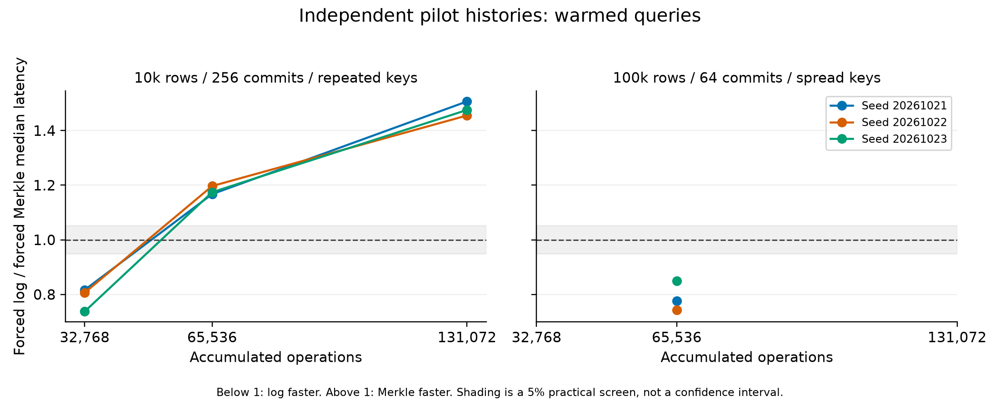
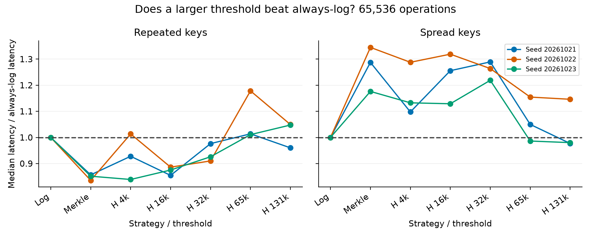
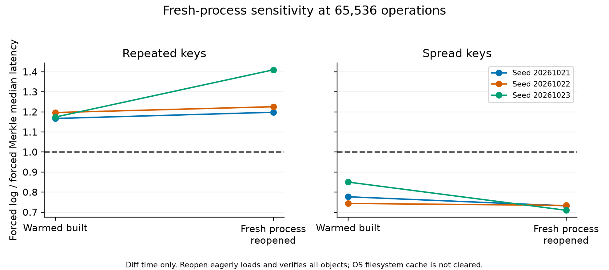

# Isolated threshold robustness pilot assessment

**Exploratory pilot only. No paper, production source, default threshold or prior evidence was changed.**

## Reviewed finding

See [SUMMARY.md](SUMMARY.md) for the short interpretation, explicit hash-seed confound, same-path timing variability and the actual mutation-mix correction. The full-scope resource-limited classification does not mean that no difference was observed in the completed subset.

## Execution and scope

Completed 12/18 independent repositories; 420 measured warmed queries and 126 measured fresh-process queries. Two warm-up blocks and five measured warmed blocks per configuration; three fresh-process blocks at 65,536 operations. Three seeds per condition are repository replications; query repetitions are nested observations.
Failures: 0; not run: 6. All completed queries matched the common semantic oracle: True. Completed case wall time: 28.3 min; maximum sampled worker RSS: 1214 MiB.

Environment: Windows-11-10.0.26200-SP0; Python 3.14.3; psutil 7.1.0; 10 physical/12 logical CPUs; 15.64 GiB RAM. Physical hardware is the existing Windows host. No Linux/cloud replication.

## Forced paths: every seed shown

Log/Merkle below 1 favours log; above 1 favours Merkle. These are ratios of within-repository medians. Query IQRs are timing dispersion, not across-history confidence intervals. Full block-paired ratios are in paired_ratios.json.

| Profile | Operations | Seed | Cache | Log ms [IQR] | Merkle ms [IQR] | Log/Merkle | H131k gain vs H16k |
|---|---:|---:|---|---|---|---:|---:|
| repeated-key | 32,768 | 20261021 | warmed-built | 8.08 [7.95, 8.29] | 9.90 [9.49, 10.12] | 0.817 | +18.3% |
| repeated-key | 32,768 | 20261022 | warmed-built | 9.41 [8.90, 11.10] | 11.67 [11.06, 12.52] | 0.806 | +29.9% |
| repeated-key | 32,768 | 20261023 | warmed-built | 10.11 [9.73, 11.31] | 13.70 [13.66, 14.88] | 0.738 | +19.1% |
| repeated-key | 65,536 | 20261021 | fresh-process-reopened | 17.47 [17.46, 18.28] | 14.58 [12.31, 14.59] | 1.198 | -22.9% |
| repeated-key | 65,536 | 20261022 | fresh-process-reopened | 18.17 [17.89, 18.42] | 14.82 [14.72, 14.91] | 1.226 | +23.1% |
| repeated-key | 65,536 | 20261023 | fresh-process-reopened | 19.30 [17.90, 20.19] | 13.69 [12.85, 14.14] | 1.410 | -18.3% |
| repeated-key | 65,536 | 20261021 | warmed-built | 14.96 [14.50, 15.08] | 12.82 [12.21, 13.72] | 1.167 | -12.3% |
| repeated-key | 65,536 | 20261022 | warmed-built | 16.09 [16.05, 16.74] | 13.44 [12.99, 14.71] | 1.197 | -18.4% |
| repeated-key | 65,536 | 20261023 | warmed-built | 14.23 [13.85, 14.40] | 12.11 [11.71, 12.36] | 1.174 | -19.7% |
| repeated-key | 131,072 | 20261021 | warmed-built | 27.31 [26.46, 27.55] | 18.13 [16.96, 19.03] | 1.507 | -51.3% |
| repeated-key | 131,072 | 20261022 | warmed-built | 26.49 [26.23, 29.59] | 18.21 [17.34, 18.26] | 1.455 | -53.5% |
| repeated-key | 131,072 | 20261023 | warmed-built | 26.58 [25.88, 27.66] | 18.01 [17.56, 18.81] | 1.476 | -36.0% |
| spread | 65,536 | 20261021 | fresh-process-reopened | 340.57 [332.47, 346.40] | 465.56 [443.37, 466.82] | 0.732 | +26.7% |
| spread | 65,536 | 20261022 | fresh-process-reopened | 419.19 [410.38, 423.09] | 571.30 [529.51, 573.49] | 0.734 | +26.0% |
| spread | 65,536 | 20261023 | fresh-process-reopened | 398.82 [395.34, 403.50] | 562.21 [524.60, 568.86] | 0.709 | +24.2% |
| spread | 65,536 | 20261021 | warmed-built | 315.27 [311.02, 315.37] | 405.89 [371.18, 416.51] | 0.777 | +22.2% |
| spread | 65,536 | 20261022 | warmed-built | 305.17 [294.53, 344.68] | 410.44 [407.32, 410.70] | 0.744 | +13.1% |
| spread | 65,536 | 20261023 | warmed-built | 402.78 [384.12, 403.40] | 473.81 [457.55, 483.26] | 0.850 | +13.2% |

## Selector versus always-log

| Profile | Operations | Seed | Cache | H4k/log | H16k/log | H32k/log | H65k/log | H131k/log |
|---|---:|---:|---|---:|---:|---:|---:|---:|
| repeated-key | 32,768 | 20261021 | warmed-built | 1.219 | 1.217 | 1.000 | 1.038 | 0.995 |
| repeated-key | 32,768 | 20261022 | warmed-built | 1.100 | 1.279 | 0.877 | 0.958 | 0.897 |
| repeated-key | 32,768 | 20261023 | warmed-built | 1.377 | 1.184 | 0.994 | 0.976 | 0.959 |
| repeated-key | 65,536 | 20261021 | fresh-process-reopened | 0.842 | 0.830 | 0.887 | 0.986 | 1.020 |
| repeated-key | 65,536 | 20261022 | fresh-process-reopened | 0.874 | 0.798 | 0.704 | 1.005 | 0.614 |
| repeated-key | 65,536 | 20261023 | fresh-process-reopened | 0.548 | 0.779 | 0.809 | 0.897 | 0.922 |
| repeated-key | 65,536 | 20261021 | warmed-built | 0.928 | 0.855 | 0.976 | 1.014 | 0.960 |
| repeated-key | 65,536 | 20261022 | warmed-built | 1.013 | 0.886 | 0.910 | 1.178 | 1.049 |
| repeated-key | 65,536 | 20261023 | warmed-built | 0.839 | 0.875 | 0.926 | 1.011 | 1.048 |
| repeated-key | 131,072 | 20261021 | warmed-built | 0.684 | 0.640 | 0.611 | 0.619 | 0.968 |
| repeated-key | 131,072 | 20261022 | warmed-built | 0.640 | 0.674 | 0.673 | 0.683 | 1.034 |
| repeated-key | 131,072 | 20261023 | warmed-built | 0.741 | 0.745 | 0.657 | 0.689 | 1.013 |
| spread | 65,536 | 20261021 | fresh-process-reopened | 1.281 | 1.321 | 1.330 | 1.019 | 0.968 |
| spread | 65,536 | 20261022 | fresh-process-reopened | 1.361 | 1.315 | 1.196 | 1.018 | 0.973 |
| spread | 65,536 | 20261023 | fresh-process-reopened | 1.375 | 1.342 | 1.344 | 1.010 | 1.017 |
| spread | 65,536 | 20261021 | warmed-built | 1.098 | 1.256 | 1.289 | 1.050 | 0.977 |
| spread | 65,536 | 20261022 | warmed-built | 1.288 | 1.319 | 1.264 | 1.155 | 1.146 |
| spread | 65,536 | 20261023 | warmed-built | 1.133 | 1.129 | 1.219 | 0.986 | 0.980 |

## Practical interpretation

The 5% screen was frozen as an exploratory investigation criterion. It is not statistical significance or a certificate of robustness.
- repeated-key, 32,768, warmed-built: seed outcomes = log, log, log; H131k versus H16k gains = +18.3%, +29.9%, +19.1%.
- repeated-key, 65,536, fresh-process-reopened: seed outcomes = Merkle, Merkle, Merkle; H131k versus H16k gains = -22.9%, +23.1%, -18.3%.
- repeated-key, 65,536, warmed-built: seed outcomes = Merkle, Merkle, Merkle; H131k versus H16k gains = -12.3%, -18.4%, -19.7%.
- repeated-key, 131,072, warmed-built: seed outcomes = Merkle, Merkle, Merkle; H131k versus H16k gains = -51.3%, -53.5%, -36.0%.
- spread, 65,536, fresh-process-reopened: seed outcomes = log, log, log; H131k versus H16k gains = +26.7%, +26.0%, +24.2%.
- spread, 65,536, warmed-built: seed outcomes = log, log, log; H131k versus H16k gains = +22.2%, +13.1%, +13.2%.

**Conclusion: D. The pilot was inconclusive or resource-limited.**

The existing one-seed diagnostic ratios at 32,768 / 65,536 / 131,072 were 1.108 / 0.921 / 1.396. Compare these with the independent seed outcomes above; no old measurements are pooled into this pilot. Different seed, hash order, process state and resource conditions can contribute to differences.

Distinct touched keys, final output sizes, mutation mix and traversal counters are recorded. The two profiles change both repository size and history length as well as locality. Therefore profile contrasts do not causally isolate locality or prove a better predictor. Any explanatory association remains a hypothesis.

## Correctness, cache and limitations

Every timed output is compared with a common canonical oracle. Warm workers also verify reverse/identity diffs, three historical states and full repository integrity. Reopened workers verify persistent objects and their first diff before later correctness work. Canonical output materialization is included in diff timing; construction, opening, integrity, correctness and standalone decision probes are separate.
The implementation eagerly decodes all persistent objects and verifies integrity on open. Fresh-process measurements therefore begin with a populated object model. They test new process/allocation state, not true cold filesystem IO. open_verify_ms and open_plus_diff_ms are retained; the latter excludes process startup.
No default change, threshold selection, held-out validation, cross-machine replication or population confidence interval is claimed. Seven selector/path timings on each seed share a repository; they are not seven independent histories. No timing outliers are removed. Resource failures remain visible.

## Follow-up recommendation and resource planning

If pursuing a larger study, first orthogonally vary locality while holding row count/history length constant; vary output size independently where feasible. Allocate fresh calibration and validation seeds, freeze selection before validation, and include always-log and forced-Merkle baselines. Use seed/repository-level paired uncertainty; use pilot dispersion to set replication targets rather than assuming three seeds suffice.
A 10-seed version of this exact scope would cost approximately 94.3 minutes on this host if resources and timings scale similarly, plus failures and setup; this is a rough planning estimate, not a guarantee. Peak sampled RSS was 1214 MiB; additional free RAM is needed for the operating system and transient allocations. Follow-up Linux hardware testing must use a separate physical/cloud host and documented comparable conditions. It has not been launched.

## Reproduction

Run from C:\Users\admin\Desktop\Revon with the recorded interpreter. Resume only this frozen directory; a fresh run requires capturing a new protected_before.json baseline using the provided prepare script before creating its manifest.

```powershell
& 'C:\Python314\python.exe' -m experiments.threshold_robustness_pilot --output 'C:\Users\admin\Desktop\Revon\.codex_tmp\threshold_robustness_pilot\20261002-132649'
$env:PYTHONPATH = 'C:/Users/admin/AppData/Local/Temp/revon-revision-deps'
& 'C:/Users/admin/.cache/codex-runtimes/codex-primary-runtime/dependencies/python/python.exe' -m experiments.analyze_threshold_robustness_pilot --output 'C:\Users\admin\Desktop\Revon\.codex_tmp\threshold_robustness_pilot\20261002-132649'
```

The run-local prepare_reproduction.py captures a fresh protected baseline for a new output directory. The archived source snapshot and SHA-256 manifest establish the exact experiment code. Do not rerun against changed sources and call it the same frozen experiment.

## Files and protection

Protected baseline recheck: True; 700 existing files checked; commits unchanged: True. New tracked-tree candidates are only the two experimental Python files; other new outputs remain in this local ignored directory. No commit, push or paid resources.

See files_created.txt for the exact new output inventory, summary.csv for medians/IQRs and counters, raw_results.csv for all complete-case warm-up/measured queries, per-case queries.jsonl for resumable partial records, failures.json for incomplete/skipped cases, and source/ for frozen code.







## Resource omissions (not experimental failures)

```json
[
  {
    "case": "n100000-h64-spread-o32768-s20261021",
    "status": "not_run_resource_scope_reduction"
  },
  {
    "case": "n100000-h64-spread-o32768-s20261022",
    "status": "not_run_resource_scope_reduction"
  },
  {
    "case": "n100000-h64-spread-o32768-s20261023",
    "status": "not_run_resource_scope_reduction"
  },
  {
    "case": "n100000-h64-spread-o131072-s20261021",
    "status": "not_run_resource_scope_reduction"
  },
  {
    "case": "n100000-h64-spread-o131072-s20261022",
    "status": "not_run_resource_scope_reduction"
  },
  {
    "case": "n100000-h64-spread-o131072-s20261023",
    "status": "not_run_resource_scope_reduction"
  }
]
```
